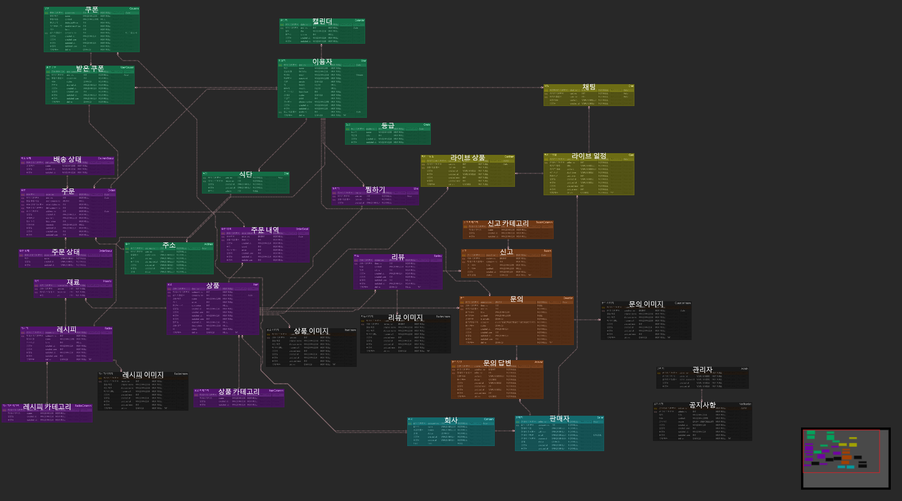
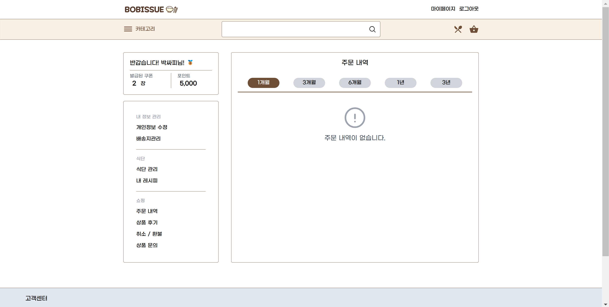
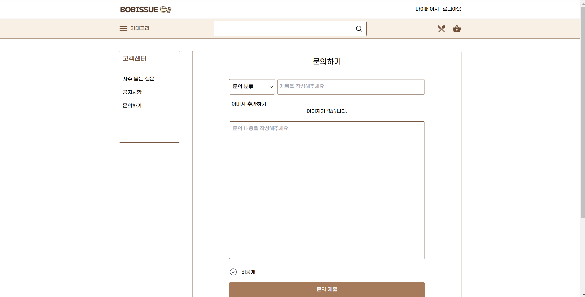
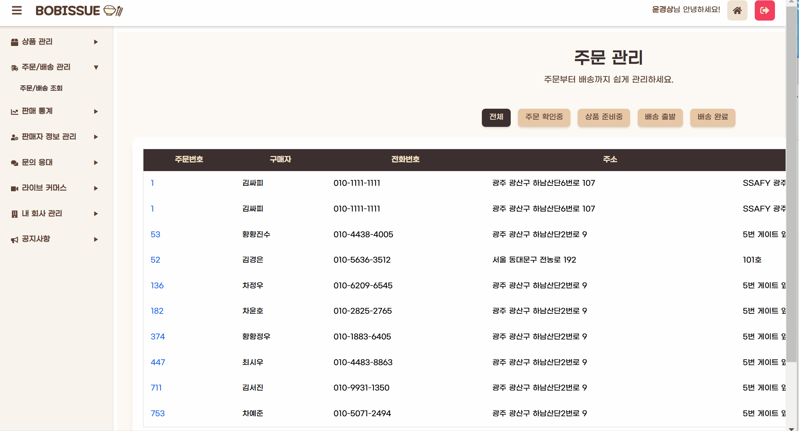
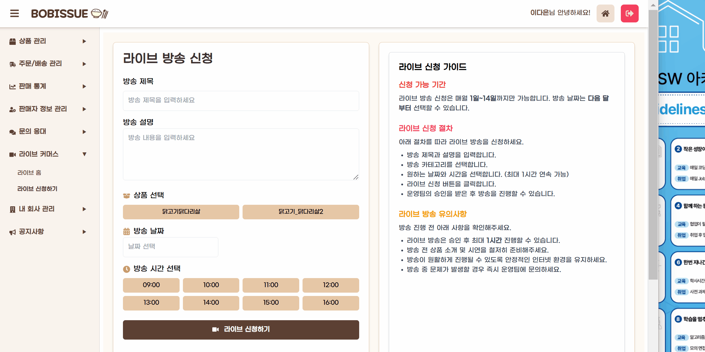
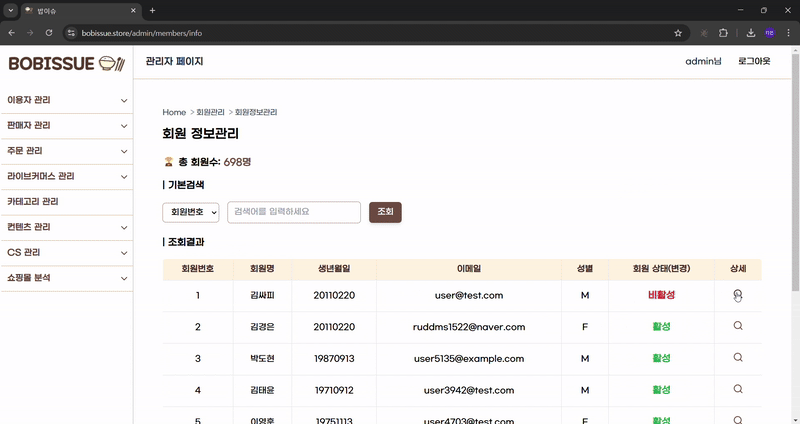
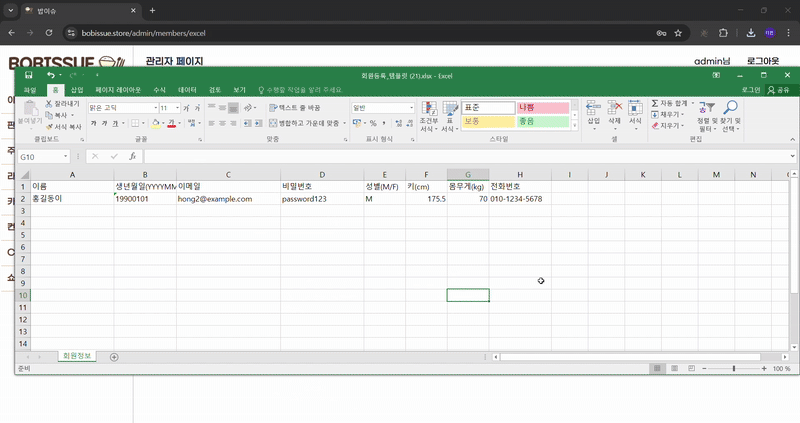
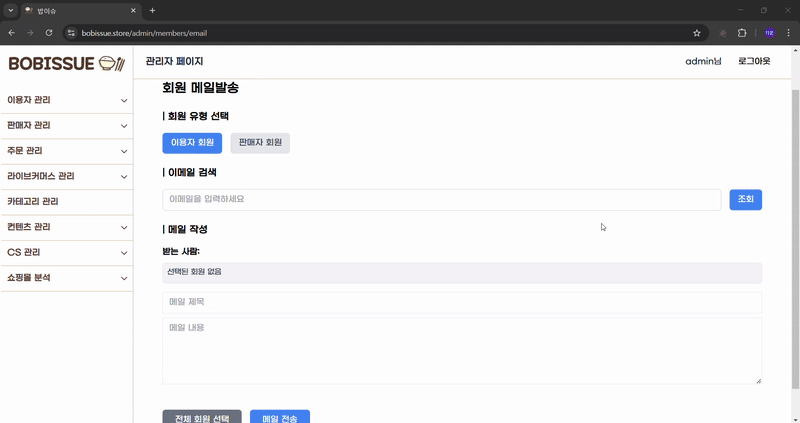
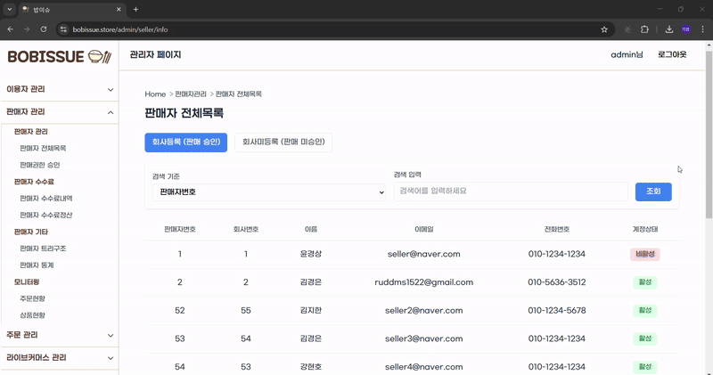
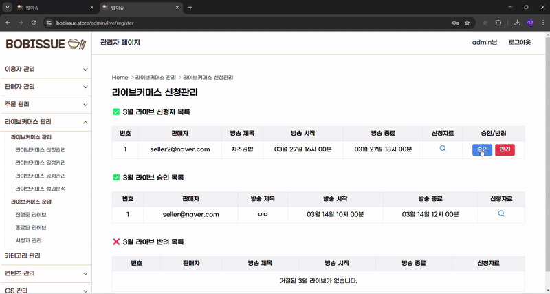

# :green_salad: 밥이슈(Bobissue)


<!-- # :green_salad: 한줄 소개
현대인들의 효율적인 건강식을 권장하는 종합 솔루션 쇼핑몰 -->

# :green_salad: 프로젝트 개요
## :rocket: 프로젝트 소개
밥이슈(Bobissue) 프로젝트는 식단 관리 서비스를 기반한 건강식 쇼필몰로 현대인들이 보다 효율적으로 건강식을 접할 수 있는 종합 솔루션 쇼핑몰이다. 또한, 라이브 커머스 기능을 제공하며 판매자의 상품 판매 및 광고하며 소비자의 구매를 유도할 수 있는 기능 제공한다. 소비자의 성별, 나이 등을 기준을 통계 및 그래프를 제공하여 판매자가 소비자의 소비 패턴을 분석하여 판매 전략을 수립할 수 있도록 도움을 준다.


## :dart: 프로젝트 기획 배경

### :herb: 건강한 식단관리 필요성

- 만성 질환 예방 중요성 인식
- 올바른 영양 섭취의 필요성
- 다이어트 및 건강식에 대한 관심도 지속적 상승
- 건강한 생활습관 형성 욕구

### :fork_and_knife_with_plate: 맞춤형 식단 수요 증가

- 개인 건강데이터 저장 및 활용 증가
- 다양한 식단 요구사항 존재
- 편의성과 효율성 동시 추구

### :chart_with_upwards_trend: 온라인 식품 시장 성장

- 코로나 19로 인한 비대면 선호
- 신선식품 온라인 구매 증가
- MZ 세대의 온라인 쇼핑 선호
- 간편식 및 밀키트 시장 확대

## :warning: 문제점

### :mag: 개인화 부족

- 기존 식단 관리 서비스의 한계
- 쇼핑몰과의 분리로 효율성 낮은 경우 많음
    - 즉, 식단을 짜고 활용해보고 싶지만 시간이 없는 경우 직접 음식을 고르고 주문하고 기록하는 전과정이 오래 소요되고 비효율적.

### :clock3: 지속성 문제

- 단기적인 식단 관리
- 동기부여 요소 부족
- 사용자 이탈률 높음

## :pushpin: 사례

컬리? 식단 관리 서비스?

## :bulb: 서비스 해결방안

### :shopping_bags: 쇼핑몰 통합

- 식단과 쇼핑 연계
- 편리한 구매 경험
- 신선식품 제공
- 시간 절약 가능

### :link: 원스톱 솔루션

- 식단 계획부터 구매까지
- 한 플랫폼에서 해결
- 사용자 편의성 증대
- 통합 서비스 제공

## :key: 주요 기능 및 핵심 서비스

### :shopping_cart: 쇼핑몰

- 식재료 판매
- 건강식품 제공
- 맞춤형 상품 추천
- 편리한 구매 경험

### :movie_camera: 라이브 커머스

- 실시간 상품 소개
- 즉각적인 질의응답
- 특별 할인 혜택

### :green_salad: 식단 관리

- 개인화된 식단 관리
- 칼로리 및 영양 계산
- 식단 기록 및 레시피 공유
- 쇼핑몰 연계 식단 관리 및 즉시 주문

</br>
</br>

# :green_salad: 개발 환경

## :iphone: 프론트엔드


| 항목 | 기술 |
|------|------|
| **개발 환경** |  |
| **프로그래밍 언어** |  |
| **빌드 도구** |  |
| **프레임워크** |  |
| **상태 관리** |  |
| **CSS 프레임워크** |  |
| **인증/보안** |  |


## :computer: 백엔드

| 항목 | 기술 |
|------|------|
| **프로그래밍 언어** |  |
| **개발 환경** |  |
| **빌드 도구** |  |
| **프레임워크** |  |
| **보안** |   |


## :gear: 공통

| 항목 | 기술 |
|------|------|
| **형상 관리** |   |
| **협업** |   |
| **데이터베이스** |     |
| **커뮤니케이션** |  |
| **배포** |    |

</br>
</br>

# :green_salad: 요구사항 분석(기능 명세서)
## :bust_in_silhouette: 이용자

<details>

| 권한 | 대분류 | 중분류 | 소분류 | 설명 |
|------|--------|--------|--------|------|
| 이용자 | 1. 회원가입 | 1-1. 회원가입 |  | 필수: 아이디, 비밀번호, 이름, 주소, 닉네임, 전화, 이메일, 생년월일, 성별 <br> 동의: 이용약관, 개인정보 수집 및 이용 <br> 선택: 수신 동의, 사진 |
|  |  | 1-2. 소셜 회원가입 |  |  |
|  | 2. 로그인 | 2-1. 로그인 |  | 아이디 & 비밀번호 입력 후 로그인 |
|  |  | 2-2. 소셜 로그인 |  | 네이버, 카카오 간편 로그인 지원 |
|  |  | 2-3. 비밀번호 찾기 |  |  |
|  | 3. 로그아웃 |  |  |  |
|  | 4. 회원 등급 | 4-1. 등급 확인 |  | 구매 금액에 따른 포인트 적립 및 등급제 운영 |
|  | 5. 네비게이션바 | 5-1. 카테고리 | 5-1-1. 종류별 | 닭고기, 소고기/돼지고기, 김밥/도시락/볶음밥, 샐러드/과일 등 |
|  |  |  | 5-1-2. 목적별 | 간편식, 다이어트, 영양식, 벌크업 |
|  | 6. 라이브 커머스 | 6-1. 라이브 일정 보기 |  | 라이브 커머스 방송 리스트 표시 |
|  |  | 6-2. 라이브 시청 |  | 라이브 방송 시청 및 채팅 가능 |
|  | 7. 상품 조회 | 7-1. 상품 목록 |  | 상품 이미지, 이름, 가격 등 정보 조회 |
|  | 8. 상품 상세 | 8-1. 상품 상세정보 |  | 상품 설명, 영양성분, 판매자 정보 등 |
|  |  | 8-2. 상품 찜 | 8-2-1. 찜하기 | 마이페이지에서 확인 가능 |
|  | 9. 장바구니 | 9-1. 장바구니 목록 | 9-1-1. 상품 정보 조회 | 수량, 옵션 수정 및 삭제 가능 |
|  | 10. 결제 | 10-1. 배송지 | 10-1-1. 배송지 선택 | 기본 배송지 설정 가능 |
|  |  | 10-2. 결제 금액 | 10-2-1. 할인 쿠폰 | 관리자 발급 쿠폰 적용 가능 |
|  |  | 10-5. 결제 |  | 결제 API 호출 |
|  | 11. 마이페이지 | 11-1. 주문 목록 | 11-1-1. 주문 내역 조회 | 주문 기간 선택 및 상품 검색 가능 |
|  | 12. 고객센터 | 12-1. FAQ |  | 자주 묻는 질문 카테고리 제공 |
|  | 13. 레시피 | 13-1. 레시피 생성 | 13-1-1. 레시피 작성 | 레시피명, 시간, 방법 기입 |

</details>

## :convenience_store: 판매자

<details>

| 권한 | 대분류 | 중분류 | 소분류 | 설명 |
|------|--------|--------|--------|------|
| 판매자 | 1. 회원가입 | 1-1. 회원 가입 |  | 회원가입 유형: 사업자 전용 |
|  | 2. 로그인 | 2-1. 로그인 |  | 판매자는 소셜 로그인 불가 |
|  | 4. 판매자 페이지 | 4-1. 상품 목록 관리 | 4-1-1. 상품 정보 목록 조회 | 상품명, 가격, 상세설명, 재고 포함 |
|  |  | 4-2. 상품 관리 | 4-2-1. 상품 정보 등록 | 상품명, 가격, 재고, 할인 설정 가능 |
|  |  | 4-3. 주문/배송 관리 | 4-3-1. 주문 목록 조회 | 구매자의 배송 처리 목록 조회 |
|  |  |  | 4-3-2. 출고 관리 | 이용자 구매 상품 배송 |
|  |  | 4-4. 정산 | 4-4-1. 정산 조회 | 정산 금액 및 날짜 확인 가능 |
|  |  | 4-5. 판매자 정보 관리 | 4-5-1. 판매자 정보 조회 | 판매자 등급, 판매 내역 확인 |
|  | 5. 고객 관리 | 5-1. 1:1 문의 응대 | 5-1-1. 문의 조회 | 이용자 문의 목록 조회 및 상세 답변 |
|  | 6. 라이브 커머스 | 6-1. 라이브 신청하기 |  | 관리자에게 라이브 방송 신청 가능 |
|  | 7. 판매 통계 | 7-1. 판매 성과 조회 |  | 결제 금액 및 환불 현황 일별 분석 |
|  | 9. 레시피 | 9-1. 레시피 생성 | 9-1-1. 레시피 작성 | 레시피명, 시간, 방법 입력 |

</details>

## :cop: 관리자 

<details>

| 권한 | 대분류 | 중분류 | 소분류 | 설명 |
|------|--------|--------|--------|------|
| 관리자 | 1. 로그인/로그아웃 |  |  |  |
|  | 2. 일반 회원 관리 | 2-1. 회원 목록 조회 |  | 전체 회원 및 특정 회원 조회 |
|  |  | 2-2. 회원 상세 조회 | 2-2-1. 회원 정보 조회 | 개인정보 및 등급 조회 |
|  | 3. 판매자 회원 관리 | 3-1. 판매자 목록 조회 | 3-1-1. 전체 판매자 조회 | |
|  |  | 3-2. 판매자 상세 조회 | 3-2-1. 판매자 신청 조회 | 판매자가 상품 판매 신청한 목록 |
|  |  |  | 3-2-2. 판매자 정보 조회 | 해당 회사의 계정 수, 활동 내역, 판매 제품 등 |
|  |  |  | 3-2-3. 판매자 활성화 | 비활성화된 판매자 계정 활성화 |
|  | 4. 라이브 커머스 | 4-1. 라이브 시간표 관리 | 4-1-1. 라이브 신청받기 | 판매자가 신청한 라이브 관리 |
|  | 5. 컨텐츠 관리 | 5-1. 쿠폰 관리 | 5-1-1. 쿠폰 현황 조회 | 사이트 내 모든 쿠폰 조회 |
|  |  | 5-2. 화면 관리 | 5-2-1. 이벤트 배너 등록 | 이벤트 배너 생성 및 관리 |
|  | 6. CS 관리 | 6-1. 알림 관리 | 6-1-1. 알림 보내기 | 전체 및 개별 알림 전송 가능 |
|  |  | 6-2. 고객 센터 관리 | 6-2-1. 문의 조회 | 이용자 문의 내용 확인 |
|  |  | 6-3. 공지사항 관리 | 6-3-1. 공지사항 조회 | 이용자/판매자별 공지 구분 가능 |

</details>
</br>
</br>


#  :spiral_calendar: WBS
<details>
  <summary> BobIssue WBS 보기 </summary>
  [WBS 보기](image/WBS.pdf)
</details>

</br>
</br>

# :card_file_box: ERD

<details>
  <summary> BobIssue ERD 보기 </summary>
  
</details>

</br>
</br>

# :iphone: 화면설계서

<details>
  <summary> 이용자 Wireframe 보기 </summary>
  
</details>
</br>
<details>
  <summary> 판매자 Wireframe 보기 </summary>
  
</details>
</br>
<details>
  <summary> 관리자 Wireframe 보기 </summary>
  
</details>

</br>
</br>


# :building_construction: 아키텍처 설계도
<details>
  <summary> 아키텍처 설계도 보기 </summary>
  
</details>


# :movie_camera: API 연동규격서
<details>
  <summary> API 연동규격서 보기 </summary>
  [API 명세서 보기](image/API.pdf)
</details>
</br>
</br>

# :hammer_and_pick: 중점 기술

<details>
  <summary> Querydsl </summary>

## QueryDSL

### 개념
- **타입 안전한 SQL 쿼리 빌더**
  - 컴파일 시점에 오류를 잡아낼 수 있어 안정적
  - IDE의 자동완성 기능을 활용할 수 있어 개발이 수월함
  - 동적 쿼리 작성이 매우 편리함

- **실무적 이점**
  - 쿼리 조건들을 재사용하기 쉬움
  - 코드 기반이라 유지보수가 용이함
  - 복잡한 서브쿼리나 조인도 깔끔하게 표현 가능
  - 메서드 체이닝으로 직관적인 쿼리 작성이 가능함

- **주의해야 할 점**
  - 실행되는 SQL을 확인하며 성능을 고려해야 함
  - 기본적인 SQL 지식이 반드시 필요함

### JPQL과 비교했을 때의 장점
- 복잡한 연산 과정에서 가독성이 더 높음
- 유지보수가 용이함
- 컴파일 단계에서 쿼리 오류가 감지됨
- 카테고리 수가 많고 사용자 데이터가 다양한 쇼핑몰의 특성에 적합함
- 복잡한 필터링 조건이나 로직을 효율적으로 처리 가능

### 프로젝트에서 QueryDSL을 사용한 이유

1. **복잡한 추천 시스템 구현**
   - 카테고리와 인구통계학적 데이터(성별, 연령대)를 결합한 맞춤형 상품 추천 시스템 구현
   - 구매 이력 기반 협업 필터링 알고리즘 구현
   - 레시피 기반 연관 상품 추천 기능 개발

2. **다양한 통계 분석 요구사항 충족**
   - 성별에 따른 상품 선호도 분석 (getMalePreferredItems, getFemalePreferredItems)
   - 재구매율이 높은 제품 분석 (getTopRepurchaseItems)
   - 베스트셀러 상품 분석 (getBestSellerItems)

3. **서브쿼리와 복잡한 조인 처리**
   - 다양한 엔티티 간의 복잡한 관계를 효율적으로 처리 (상품, 주문, 사용자, 리뷰 등)
   - 중첩된 서브쿼리를 가독성 있게 구현

4. **동적 표현식 활용**
   - 사용자 연령대 계산을 위한 동적 표현식 생성 (ageGroupExpr)
   - 복잡한 통계 수식을 SQL 함수와 결합하여 구현

### Querydsl 도입 효과

1. **효율적인 코드 관리**
   - 복잡한 쿼리를 체계적으로 관리할 수 있어 유지보수가 용이했습니다
   - 각 기능별 메소드 분리로 코드 재사용성이 향상되었습니다

2. **성능 최적화 경험**
   - 쿼리 성능을 고려한 설계가 중요하다는 것을 실감했습니다
   - 단순 ORM 방식보다 복잡한 비즈니스 로직을 DB 레벨에서 처리하여 성능 향상을 경험했습니다

3. **비즈니스 인사이트 도출**
   - 데이터 기반 통계를 통해 판매자와 관리자, 사용자에게 유용한 인사이트를 제공할 수 있었습니다
   - 사용자 행동 패턴 분석을 통한 맞춤형 서비스 구현이 가능해졌습니다

4. **타입 안전성의 중요성**
   - 컴파일 시점에 오류를 잡아낼 수 있어 런타임 에러를 크게 줄일 수 있었습니다
   - 복잡한 쿼리 작성 시 IDE의 자동완성 기능이 개발 생산성을 크게 향상시켰습니다

### 프로젝트 활용
1. **상품 추천 시스템**
   - 성별/연령대별 구매 패턴 분석
   - 카테고리별 인기 상품 추출
   - 연관 상품 추천

2. **매출 분석**
   - 기간별 매출 집계
   - 판매자별 실적 분석
   - 상품별 판매 통계
   - 시간대별 판매 분석
   - 판매량 예측


3. **고객 행동 분석**
   - 구매 패턴 분석
   - 재구매율 계산
   - 성별/연령대별 선호도 분석

  
</details>


<details>
  <summary> AWS S3 </summary>

  ### 1. 의존성 추가
```gradle
implementation group: 'com.amazonaws', name: 'aws-java-sdk-s3', version: '1.12.780' // S3 버킷 접근
implementation 'io.awspring.cloud:spring-cloud-aws-starter:3.1.1' // SpringBoot AWS 통합
implementation 'org.springframework.cloud:spring-cloud-starter-aws:2.2.6.RELEASE'
```

#### 사용 버전
- Java 17
- Spring Boot 3.4.1

### 2. 설정 파일 작성

#### application.yml
```yaml
spring:
  application:
    name: spring-project
  profiles:
    include: aws
```

#### application-aws.yml
```yaml
cloud:
  aws:
    credentials:
      access-key: [your-access-key]
      secret-key: [your-secret-key]
    region:
      static: ap-northeast-2
    stack:
      auto: false
    s3:
      bucket: example-dev-storage-ap
```

### 3. S3 설정 클래스 구현

```java
@Configuration
public class S3Config {
    @Value("${cloud.aws.credentials.access-key}")
    private String accessKey;

    @Value("${cloud.aws.credentials.secret-key}")
    private String secretKey;

    @Value("${cloud.aws.region.static}")
    private String region;

    @Bean
    public AmazonS3Client amazonS3Client() {
        BasicAWSCredentials awsCredentials = new BasicAWSCredentials(accessKey, secretKey);
        
        return (AmazonS3Client) AmazonS3ClientBuilder.standard()
                .withRegion(region)
                .withCredentials(new AWSStaticCredentialsProvider(awsCredentials))
                .build();
    }
}
```

### 4. S3Service 구현

```java
@Service
@RequiredArgsConstructor
public class S3Service {
    private final AmazonS3Client amazonS3Client;

    @Value("${cloud.aws.s3.bucket}")
    private String bucket;
    
    // 파일 업로드
    public String uploadFile(String dirName, MultipartFile file) {
        try {
            validateFile(file);
            
            String fileName = createFileName(getExtension(file.getOriginalFilename()));
            String fileUrl = dirName + "/" + fileName;

            ObjectMetadata metadata = new ObjectMetadata();
            metadata.setContentType(file.getContentType());
            metadata.setContentLength(file.getSize());

            amazonS3Client.putObject(
                    new PutObjectRequest(bucket, fileUrl, file.getInputStream(), metadata)
                            .withCannedAcl(CannedAccessControlList.PublicRead)
            );

            return amazonS3Client.getUrl(bucket, fileUrl).toString();

        } catch (IOException e) {
            throw new BobIssueException(ResponseCode.FILE_UPLOAD_ERROR);
        }
    }
    
    // 파일 검증
    private void validateFile(MultipartFile file) {
        String contentType = file.getContentType();
        if (contentType == null || !contentType.startsWith("image/")) {
            throw new BobIssueException(ResponseCode.INVALID_FILE_TYPE);
        }

        if (file.getSize() > 10 * 1024 * 1024) {
            throw new BobIssueException(ResponseCode.FILE_SIZE_EXCEED);
        }
    }
    
    // 파일명 생성
    private String createFileName(String ext) {
        return new SimpleDateFormat("yyyyMMddHHmmss").format(new Date())
                + "-"
                + UUID.randomUUID().toString()
                + ext;
    }

    private String getExtension(String fileName) {
        if (fileName == null) return "";
        int lastIndex = fileName.lastIndexOf(".");
        if (lastIndex == -1) return "";
        return fileName.substring(lastIndex);
    }
    
    // 여러 파일 업로드
    public List<String> uploadFiles(String dirName, List<MultipartFile> files) {
        return files.stream()
                .map(file -> uploadFile(dirName, file))
                .collect(Collectors.toList());
    }
    
    // 파일 삭제
    public void deleteFile(String fileUrl) {
        try {
            String key = extractKeyFromUrl(fileUrl);
            amazonS3Client.deleteObject(bucket, key);
        } catch (Exception e) {
            throw new BobIssueException(ResponseCode.FAILED_DELETE_IMAGE);
        }
    }

    private String extractKeyFromUrl(String fileUrl) {
        try {
            java.net.URL url = new java.net.URL(fileUrl);
            String path = url.getPath();
            if (path.startsWith("/")) {
                path = path.substring(1);
            }
            return path;
        } catch (Exception e) {
            throw new BobIssueException(ResponseCode.INVALID_FILE_URL);
        }
    }

    public void deleteFiles(List<String> fileUrls) {
        for (String fileUrl : fileUrls) {
            deleteFile(fileUrl);
        }
    }
}
```

### 5. 사용 예시

```java
// 단일 파일 업로드
String fileUrl = s3Service.uploadFile("images", multipartFile);

// 여러 파일 업로드
List<String> fileUrls = s3Service.uploadFiles("images", multipartFiles);

// 파일 삭제
s3Service.deleteFile(fileUrl);
```

## AWS S3 구현을 통해 얻은 인사이트

1. **클라우드 스토리지의 이점**
   - 서버 부하 감소 및 이미지 로딩 속도 개선
   - 대용량 파일의 안정적 처리 가능
   - 상품 이미지 다수 관리에 필요한 확장성 확보

2. **보안과 성능의 균형**
   - 사용자 입력값 검증의 중요성 인식
   - XSS, 악성코드 등 보안 취약점 사전 방지

3. **개발 생산성 향상**
   - 파일 관리 로직 추상화로 코드 간결화
   - 여러 기능에서 코드 재사용 가능
   - 통일된 예외 처리로 유지보수 용이

4. **비용 최적화**
   - S3 사용 비용 모니터링 방법 학습
   - 불필요한 파일 저장 방지 정책 수립
</details>

<details>
  <summary> OAuth2 </summary>

  ## OAuth2

  ### 개념
  
  - OAuth 2.0은 인증 및 권한 부여를 위한 업계 표준 프로토콜  
  - 사용자의 계정 정보를 외부 서비스에 제공하지 않고 안전하게 로그인 및 권한을 위임하는 방식  

  ### Spring Security + OAuth2 로그인 흐름

  1. 로그인 버튼 클릭
  2. Spring Security의 OAuth2 Client가 카카오 로그인 페이지로 리디렉션
  3. 사용자가 카카오 로그인 후 인가 코드 반환
  4. Spring Security가 인가 코드를 이용해 Access Token 요청
  5. Access Token을 이용해 사용자 정보 요청
  6. 응답받은 사용자 정보를 기반으로 회원가입 또는 로그인 처리
  7. JWT를 발급하여 클라이언트에 전달  

</details>

<details>
  <summary> JWT 기반 Access Token & Refresh Token </summary>

  ## JWT

  ### 개념

  - JWT(JSON Web Token)는 사용자 인증 및 정보 전달을 위해 사용하는 토큰 방식
  - JSON 형태로 정보를 담아 Base64Url로 인코딩하여 사용
  - 서명을 포함하여 변조를 방지할 수 있음
  - 별도의 세션 저장소 없이 인증 가능해 Stateless함

  ### 구조

  - Header : 알고리즘, 타입 정보
  - Payload : 사용자 정보, 권한 등
  - Signature : 서명, 변조 방지

  ### 사용 이유

  - 세션 방식보다 효율적<br>

    - 서버에서 별도의 세션 저장 없이 Stateless 인증 가능 <br>

    - 여러 개의 서버에서도 동일한 인증 유지 가능 <br>

  - 보안성이 높음
  - RESTful API에 적합

  ## Access Token & Refresh Token 전략 구현 방식

  ### 1. JWT 기반의 Token 발급

  - Access Token

    - 짧은 유효기간

    - 사용자 인증 시 API 요청에 사용

    - 클라이언트가 요청마다 포함하여 서버로 전송

  - Refresh Token

    - 긴 유효기간

    - Access Token이 만료되었을 때 새로 발급하는 데 사용

    - Redis에 저장하여 보안 강화


  ### 2. Access Token 검증

  - API 요청마다 Authorization: Bearer {AccessToken} 헤더를 확인

  - Access Token이 유효하면 → 요청 처리 후 응답 반환

  - Access Token이 만료되었으면 Refresh Token을 확인

  
  
  ### 3. Refresh Token 검증 및 Access Token 재발급

  - Refresh Token은 Redis에 저장

  - Access Token이 만료되었을 때, Refresh Token을 확인

    - 유효하면 → 새로운 Access Token을 발급 후 응답

    - 유효하지 않으면 → 로그아웃 처리

  
  
  ### 4. 로그아웃 시 Refresh Token 삭제

  - 사용자가 로그아웃하면 Redis에서 해당 Refresh Token을 즉시 삭제

  - 이후 해당 사용자는 Refresh Token을 사용할 수 없음 → 재로그인이 필요

  ## 보안적 강점

  ### 1. Refresh Token 탈취 방지
클라이언트에 저장하지 않고 서버(Redis)에서만 관리하여 유출 위험 감소

  ### 2. 토큰 강제 만료 가능

  - WT 자체는 만료 전까지 무효화할 수 없지만, Redis에서 Refresh Token을 관리하면 원하는 시점에 즉시 만료 가능

  - 로그아웃 시 Refresh Token을 삭제하여 탈취된 토큰이더라도 사용할 수 없음

  ### 3. 서버 확장성 유지

  Stateless한 JWT의 장점을 유지하면서도 Redis를 활용하여 안전하게 인증 관리 가능


</details>

<details>
  <summary> WebSocket </summary>

## WebSocket

### WebSocket이란?
WebSocket은 **실시간 양방향 통신**을 가능하게 하는 프로토콜입니다.  

- 클라이언트와 서버가 **지속적으로 연결을 유지**하며 데이터를 주고받음  
- HTTP보다 **오버헤드가 낮고 빠름**  
- **실시간 채팅, 알림 시스템 등** 다양한 서비스에 활용 가능  

---

### WebSocket과 HTTP의 차이점  

| **비교 항목**     | **WebSocket**                         | **HTTP**                          |
|------------------|--------------------------------|--------------------------------|
| **연결 방식**    | 지속적인 연결 유지                 | 요청-응답 후 연결 종료               |
| **데이터 교환 방식** | 클라이언트 ↔ 서버 간 자유롭게 메시지 전송 가능 | 클라이언트 요청에 서버가 응답           |
| **사용 사례**    | 실시간 채팅, 주식 시세, 알림          | 일반적인 웹페이지 요청/응답         |

---

### STOMP vs Socket.IO  

| **비교 항목**     | **STOMP**                           | **Socket.IO**                      |
|------------------|--------------------------------|----------------------------------|
| **기반 프로토콜**  | WebSocket + 메시징 프로토콜       | WebSocket + HTTP 폴백             |
| **서버 환경**     | Spring WebSocket과 결합         | Node.js 기반의 실시간 앱           |
| **데이터 전송**    | 메시지 큐 기반 (Pub/Sub)         | 이벤트 기반 통신                   |
| **브라우저 지원**  | WebSocket 지원 필요             | WebSocket 미지원 시 HTTP 폴링 사용 가능 |
| **사용 사례**     | 기업형 애플리케이션, 채팅 시스템, 메시지 큐 | 실시간 게임, 소셜 피드, 알림 시스템    |

---

  ### STOMP를 사용한 이유

  1. Spring WebSocket과의 높은 호환성

    - Spring Messaging을 통해 쉽게 구현 가능
  
    - Spring Security와도 연동이 쉬움

  2. 메시지 브로커(Pub/Sub) 지원

    - STOMP는 RabbitMQ, ActiveMQ, Redis Pub/Sub 같은 메시지 브로커와 통합 가능

    - 여러 서버에서 같은 메시지를 구독하고 처리할 수 있어 확장성이 뛰어남

  3. 채팅방 구조에 적합한 메시징 시스템

    - 채팅방마다 개별 topic을 만들어 구독하면, 해당 방의 사용자들만 메시지를 받을 수 있음

    - 메시지를 다수의 사용자에게 전송 처리에 용이

  4. 유지보수 용이

    - STOMP는 WebSocket을 직접 다루는 것보다 추상화되어 있어 유지보수하기 쉬움

    - 텍스트 기반 프로토콜이므로 메시지 디버깅이 쉬움


  ## WebSocket을 이용한 채팅 구현 방식

  ### 1. 클라이언트가 WebSocket 연결 요청

  ### 2. 서버가 STOMP 세션을 생성하고 연결 유지

  ### 3. 사용자가 특정 채팅방을 구독

  ### 4. 메시지 발송

  ### 5. 서버는 메시지를 해당 채팅방의 모든 사용자에게 전달

  ### 6. 사용자가 퇴장하면 세션 종료


</details>

<details>
  <summary> Redis와 MongoDB를 활용한 채팅 관리 </summary>

  ## Redis

  ### Redis의 특징

  - 인메모리 데이터베이스 -> 데이터를 메모리에 저장하여 매우 빠른 속도로 읽고 쓸 수 있음
  - Key-Value 구조 → 단순한 구조로 데이터 저장 및 접근이 용이 
  - Pub/Sub 기능 제공 → 메시지 브로커 역할을 수행하며 실시간 채팅에 적합  
  - TTL(만료 시간) 설정 가능 → 특정 시간 이후 자동 삭제되는 데이터 관리 가능  
  -  단점 : 영구 저장이 불가능하며 데이터가 많아질수록 메모리 사용량이 증가  

 ---

  ## MongoDB

  ### MongoDB의 특징

  - NoSQL 데이터베이스 → JSON 형태의 비정형 데이터를 저장하는 데 최적화  
  - 수직 및 수평 확장 용이 → 샤딩(Sharding)과 복제(Replication) 기능으로 대규모 데이터 처리 가능  
  - 빠른 조회 성능 → 인덱스를 활용하여 사용자별/채팅방별 데이터 검색 최적화 가능  
  - 대량의 데이터를 영구적으로 저장 가능 → 채팅 로그, 첨부 파일, 유저 활동 기록 관리에 적합  
  - 단점 : 관계형 데이터베이스처럼 강력한 트랜잭션 지원 부족 (하지만 채팅 데이터에는 큰 문제 없음)  

 ---

  ## MySQL

  ### MySQL의 특징
  - 관계형 데이터베이스(RDBMS) → 테이블 간 관계를 설정하여 데이터 무결성 유지  
  - ACID(Atomicity, Consistency, Isolation, Durability) 보장 → 트랜잭션 처리에 강점  
  - 정형화된 데이터 저장에 적합 → 정해진 스키마에 맞춰 데이터를 저장하는 것이 강점 

  ## MySQL로 채팅 관리를 하지 않은 이유

  ### 1. 트랜잭션 부담

  실시간 채팅에서 MySQL은 빈번한 데이터 삽입·삭제가 발생하여 성능 저하 가능  

  ### 2. 확장성 부족

  스케일 아웃(Scale-out)이 어렵고, 트래픽 증가 시 처리 성능이 급격히 저하됨 

  ### 3. 비정형 데이터 저장 비효율

  JSON 데이터를 저장할 수 있지만, 별도의 파싱 과정이 필요하여 성능 저하 발생 


  ## Redis와 MongoDB를 이용하여 채팅을 관리하게 된 이유와 장점  

  ### Redis를 활용하는 이유 (실시간 메시지 처리)
  - 빠른 데이터 처리 속도 
  
    - 인메모리 기반이므로 실시간으로 메시지를 주고받을 수 있음  

  - Pub/Sub 기능 지원
  
    - 다수의 사용자에게 동시에 메시지를 브로드캐스트 가능

  - 사용자 온라인 상태 관리 가능
  
    - TTL을 활용하여 일정 시간 후 자동으로 데이터 삭제 가능  

  ### MongoDB를 활용하는 이유 (채팅 저장)

  - 대량의 데이터 저장 가능
  
    - JSON 형식으로 비정형 데이터를 효율적으로 관리

  - 검색 및 조회 최적화
  
    - 인덱스를 활용하여 특정 사용자 또는 채팅방의 메시지를 빠르게 검색 가능

  - 확장성 우수
    - 트래픽 증가 시 샤딩을 통해 여러 노드에 데이터 분산 가능  

  ### 영구 저장을 위해 Redis와 MongoDB를 함께 사용하는 이유 및 장점

  - 하이브리드 데이터 관리 (휘발성 + 영구 저장)

    - Redis는 메모리 기반이므로 빠르지만 데이터가 휘발성(Volatile)이라 영구 저장 불가능

    - MongoDB는 디스크 기반이므로 영구 저장 가능하지만 실시간 처리가 어려움
    
    - 실시간 채팅은 Redis에서 관리하고, 일정 주기마다 데이터를 MongoDB로 저장하여 영구 보관 

  - 빠른 응답과 데이터 보존을 동시에 해결

    - 사용자가 채팅방에 접속하면 Redis에서 최근 채팅 메시지를 빠르게 불러오기
  
    - 과거 메시지 조회 시 MongoDB에서 데이터를 검색하여 제공  

  - 시스템 안정성 및 장애 대응  

    - Redis는 메모리 기반이므로 서버 재시작 시 데이터가 손실될 수 있음
    
    - MongoDB에 저장된 데이터는 서버 장애 발생 시에도 유지되어 채팅 기록을 복원 가능


</details>

<details>
  <summary> WebRtc </summary>

## WebRTC   

### WebRTC란?  
WebRTC(Web Real-Time Communication)는 웹 브라우저 및 모바일 애플리케이션에서 플러그인 없이 실시간 음성·영상 통신을 가능하게 하는 기술  

- P2P (Peer-to-Peer) 연결을 통해 데이터를 직접 주고받을 수 있음  
- 낮은 지연시간(Low Latency)을 제공하여 실시간 소통이 가능  
- 웹 표준 API를 활용하여 별도의 플러그인 없이 브라우저에서 사용 가능  

### WebRTC의 주요 기능
- 오디오 및 비디오 스트리밍  
  - 웹 브라우저 간 실시간 영상 및 음성 전송   
- P2P 기반 통신  
  - 중앙 서버를 거치지 않고, 사용자 간 직접 연결(Peer-to-Peer) 가능   
- 다양한 네트워크 환경 지원  
  - NAT 및 방화벽을 우회하여 연결 가능 (STUN/TURN 서버 활용)  

---

## WebRTC 사용 방법 

### WebRTC의 핵심 3요소
- getUserMedia()  
   - 사용자의 카메라와 마이크 권한을 요청하여 영상·오디오 데이터를 가져옴  
- RTCPeerConnection  
   - P2P 연결을 설정하고, 미디어 및 데이터를 전송    

### WebRTC 동작 방식  
1. 사용자가 카메라·마이크 접근을 허용하면 `getUserMedia()`로 미디어 스트림을 가져옴  
2. `RTCPeerConnection`을 생성하여 P2P 연결을 설정  
3. SDP(Session Description Protocol) 교환을 통해 서로의 연결 정보를 공유  
4. ICE(Interactive Connectivity Establishment) 후보를 교환하여 최적의 네트워크 경로 설정  
5. P2P 연결이 완료되면, 오디오·비디오 데이터가 스트리밍됨  

---

## WebRTC를 사용한 이유 (라이브 커머스에서 WebRTC의 장점)  

### 낮은 지연시간 (Low Latency)으로 실시간 소통 가능  
- 기존 HTTP 기반 스트리밍보다 WebRTC는 거의 실시간(초저지연) 전송을 제공 
- 판매자와 고객 간 빠른 피드백을 주고받아 실시간 소통 가능  

### 별도의 플러그인 없이 브라우저에서 사용 가능
- 크로스 플랫폼 지원 → PC/모바일 브라우저에서 플러그인 없이 동작  
- 별도의 앱 설치 없이 웹 환경에서 바로 라이브 커머스 기능 구현 가능

### P2P 연결을 통해 대역폭 사용 최적화
- 서버 부하를 줄이고 비용 절감 가능 
- 필요에 따라 SFU(Selective Forwarding Unit) 방식을 활용하여 다수의 시청자가 참여 가능 

### 다중 사용자 스트리밍 지원 (라이브 방송 및 그룹 채팅 가능)
- 판매자가 라이브 방송을 송출하고, 여러 명의 고객이 동시에 시청 가능  

### 보안성 강화 (E2E 암호화 지원)
- WebRTC는 기본적으로 암호화(Encryption)를 적용하여 보안성이 뛰어남 
- 민감한 고객 정보가 포함된 커머스 환경에서도 안전한 데이터 전송 가능  


</details>

<details>
<summary>ElasticSearch</summary>

## Elasticsearch

### 개념
## Elasticsearch란?

Apache Lucene( 아파치 루씬 ) 기반의 Java 오픈소스 분산 검색 엔진으로, 방대한 양의 데이터를 신속하게 실시간으로 저장, 검색, 분석할 수 있습니다.

엘라스틱 서치는 단독으로 사용되기도 하지만, ELK( Elasticsearch / Logstatsh / Kibana )스택으로 사용되기도 합니다.

**Logstash** : 다양한 소스( DB, csv파일 등 )의 로그 또는 트랜잭션 데이터를 수집, 집계, 파싱하여 Elasticsearch로 전달

**Kibana** : Elasticsearch의 빠른 검색을 통해 데이터를 시각화 및 모니터링

## Elasticsearch

- **실시간 검색 및 분석:**
    
    데이터가 추가되거나 수정될 때 거의 실시간으로 검색 결과에 반영되어, 빠른 검색 응답 속도를 제공합니다.
    
- **확장성:**
    
    분산 아키텍처를 채택하여 클러스터 구성으로 데이터를 여러 노드에 분산시킬 수 있어, 데이터 양이 증가하더라도 시스템 확장이 용이합니다.
    
- **강력한 검색 기능:**
    
    단순 텍스트 검색 뿐만 아니라, 복잡한 쿼리, 필터링, 집계(aggregations) 기능 등을 지원하여 다양한 비즈니스 요구사항에 맞는 검색 솔루션을 구현할 수 있습니다.
    
- **유연한 데이터 모델:**
    
    JSON 기반의 데이터 저장 방식을 채택해 스키마가 자유로워, 다양한 형태의 데이터를 손쉽게 다룰 수 있습니다.
    
- **다양한 활용 사례:**
    
    웹사이트 검색, 로그 분석, 실시간 모니터링, 데이터 분석 등 여러 분야에서 활용되며, Kibana와 같은 시각화 도구와 연계하여 데이터 인사이트를 도출하는 데 효과적입니다.
    

## nori

Elasticsearch에 한글 형태소 분석기인 nori를 적용하여 한글 문서의 색인 및 검색 성능을 최적화하였습니다.

### 사용 이유

### 의존성 추가
```
implementation 'org.springframework.data:spring-data-elasticsearch'
```

### nori 플러그인 설치
```bash
sudo bin/elasticsearch-plugin install analysis-nori
sudo systemctl restart elasticsearch
```

❗nori를 사용할 경우, 스프링에서 document.를 자동으로 생성해주지 않음

</details>

<details>
<summary>Spring Boot Starter Mail</summary>

## Spring Boot Starter Mail

Spring Boot Starter Mail을 활용해 구글 SMTP 서버를 통해 이메일 발송을 구현하였습니다.
관리자가 구매자, 판매자에게 문의 답변, 광고 등을 다양한 상황에서 이메일 전송이 필요할 때 활용할 수 있습니다.

**의존성 추가**

```xml
implementation 'org.springframework.boot:spring-boot-starter-mail'
```

`JavaMailSender` : Spring Framework에서 제공하는 인터페이스로, JavaMail API를 기반으로 이메일 발송 기능을 간편하게 사용할 수 있도록 추상화한 클래스입니다. 주로 SMTP 서버 설정을 기반으로 메일을 전송하며, 단순 텍스트 메일뿐 아니라 MIME 메시지 전송도 지원합니다.

`JavaMailSender` : JavaMailSender 인터페이스의 기본 구현체로, 실제 SMTP 서버와의 연결 설정(호스트, 포트, 사용자 인증 등)을 관리하며, JavaMailSender가 제공하는 메서드를 통해 이메일 전송을 수행합니다.

`MimeMessageHelper` : MimeMessage 객체를 보다 쉽게 생성하고 구성할 수 있도록 도와주는 헬퍼 클래스입니다. HTML 내용, 첨부파일, 인라인 이미지 등 복잡한 메일 메시지 구성이 필요한 경우, 다양한 편의 메서드를 제공하여 개발자가 복잡한 MIME 메시지를 간단하게 다룰 수 있도록 지원합니다.
</details>

# :repeat: 배포 Script


# :eyes: UI/UX 단위 결과서


## :bust_in_silhouette: 쇼핑몰 이용자 관련 기능

### 1. 로그인
<details>
<summary> :film_frames: </summary>


</details>

- 쇼핑몰 자체 회원 로그인 <br>
- 소셜 로그인 <br>

### 2. 상품 구매

<details>
<summary> :film_frames: </summary>

</details>

- Query DSL을 이용한 베스트 상품
- 상품 검색
  <details>
  <summary> :framed_picture: </summary>
  
  </details>
- 카테고리 별 상품 
  <details>
  <summary> :framed_picture: </summary>
  
  </details>
- 장바구니 - 수량 변경, 제거 <br>
- 결제 - 배송지, 포인트·쿠폰 적용, 포트원 API <br>

### 3. 라이브 커머스

<details>
<summary> :film_frames: </summary>

</details>

- 라이브 커머스 시청 및 채팅 기능 <br>
- 판매 중 상품 장바구니 담기 - 개별, 전체 <br>

### 4. 식단 관리

<details>
<summary> :film_frames: </summary>

</details>

- 이용자 키, 몸무게 정보를 바탕으로 한 일일 권장 칼로리 계산 <br>
- 캘린더를 이용한 일일 식단 등록 <br>
- 권장 칼로리 이상 섭취시 경고 표시 <br>

### 5. 레시피

<details>
<summary> :film_frames: </summary>

</details>

- 마이페이지에서 내 레시피 확인 및 작성 <br>
- 레시피 페이지에서 전체 레시피 확인 <br>
- 레시피 상세에서 관련 상품 장바구니 담기 <br>

### 6. 기타

- 마이페이지-정보관리
  <details>
  <summary> :framed_picture: </summary>
  
  
  </details>
- 마이페이지-상품관련(주문내역, 후기 등)
  <details>
  <summary> :framed_picture: </summary>
  
  
  </details>
- 고객센터(FAQ, 공지사항, 문의)
  <details>
  <summary> :framed_picture: </summary>
  
  
  </details>

## :convenience_store: 쇼핑몰 판매자 주요 기능

### 1. 로그인

<details>
<summary> :film_frames: </summary>
![seller_login]](./sellerGif/회원가입및로그인.gif)
</details>

- 판매자 계정 로그인
- 인증 및 권한 관리

### 2. 상품 관리

<details>
<summary> :film_frames: </summary>

</details>

- 상품 등록 및 수정
- 상품 목록 조회 및 검색
- 상품 삭제

### 3. 주문 및 배송 관리

<details>
<summary> :film_frames: </summary>

</details>


- 주문 내역 확인 및 처리
- 배송 상태 변경 및 추적
- 주문 취소 및 환불 관리

### 4. 라이브 커머스 운영

<details>
<summary> :film_frames: </summary>

</details>

<details>
<summary> :film_frames: </summary>

</details>

- 라이브 커머스 진행
- 실시간 채팅 지원
- 판매 중 상품 추가 및 관리

### 5. 판매 통계

<details>
<summary> :film_frames: </summary>

</details>

- 일별/주별/월별 판매량 분석
- 베스트셀러 상품 확인
- 매출 데이터 시각화

### 6. 기타

<details>
<summary> :film_frames: </summary>

</details>

- 판매자 마이페이지 - 정보 수정

- 고객 문의 관리


## :cop: 쇼핑몰 관리자 관련 기능
<details>
<summary> :film_frames: </summary>


</details>

### 1. 회원관리(1) - 이용자

<details>
<summary> :film_frames: </summary>

</details>

- 회원 상태관리(활성/비활성) <br>
- 회원 상세정보 관리 <br>

### 2. 회원등록
<details>
<summary> :film_frames: </summary>

</details>

- 엑셀 일괄등록 <br>
  - 엑셀파일 템플릿 다운로드 이후 목록 업데이트 하여 등록

### 3. 회원 메일 발송

<details>
<summary> :film_frames: </summary>

</details>

- 회원 대상 메일발송 (선택/전체 발송)

### 4. 회원관리(2) - 판매자
<details>
<summary> :film_frames: </summary>

</details>

- 판매자 상태관리(활성/비활성) <br>
- 판매자 상세정보 관리 <br>
- 판매권한 승인 절차 <br>

### 5. 판매자 트리구조
<details>
<summary> :film_frames: </summary>

</details>

- 추가계정 지급 여부에 따른 계정 현황 파악

### 6. 주문 현황
<details>
<summary> :film_frames: </summary>

</details>

- 쇼핑몰 주문 현황 검색 및 상세 관리

### 7. 라이브커머스 관리
<details>
<summary> :film_frames: </summary>

</details>

- 라이브 커머스 신청시 내부 기준에 따라 승인/반려 <br>
- 승인시 라이브 예정 캘린더에 등록 및 관리 <br>
- 라이브 모니터링 및 종료 기능 <br>

### 8. 쇼핑몰 분석 - 통계
<details>
<summary> :film_frames: </summary>
- Query DSL API를 활용하여 통계 분석 페이지 제공
  
</details>

- 판매자 통계 <br>
- 매출 분석 <br>
- 카테고리 분석 <br>
- 시간대별 분석 <br>
- 유저 통계 <br>
- 재구매율 분석 <br>

### 9. 기타

- 카테고리 관리 <br>
  - 쇼핑몰 판매 카테고리 추가 및 유지보수 <br>

- CS 관리 <br>

  - 이용자 대상 공지 및 문의사항 관리 <br>

- 기타 등등 <br>


# :green_salad: 소감

### 김지한 

쇼핑몰 시스템이 예상보다 훨씬 복잡하고 조율할 요소가 많다는 것을 깨달았습니다. 팀장으로서 이를 해결하며 프로젝트를 이끌었고, 배포와 백엔드 개발을 직접 경험하며 기술적 이해도를 높일 수 있었습니니다. 다양한 기능을 성공적으로 구현하며 한층 성장할 수 있었던 값진 경험이었습니다.

### 이다은

단순한 CRUD 개발을 넘어 서비스 운영에 최적화된 시스템 구축을 고민하며, React와 Redux를 활용해 48개의 관리자 페이지를 개발해볼 수 있었다. 최종 발표를 준비하며 우리 프로젝트를 되짚어 보고, 데이터 흐름과 API 설계까지 깊이 이해하고자 노력하였다.

### 강현호

백엔드 개발을 처음 접하면서 쇼핑몰 플랫폼을 구현하는 이번 프로젝트는 화면에서 보이는 단순한 기능들 뒤에 이렇게 복잡한 로직과 구조가 숨어있다는 사실에 놀랐습니다. 처음에는 낯설었던 기술 스택들을 하나씩 익히고 적용해가는 과정에서 많은 시행착오를 겪었지만, 결과적으로 안정적인 시스템을 구축할 수 있었던 점이 가장 보람찼습니다.

### 김지원

처음 컨설턴트님께서 쇼핑몰이 굉장히 큰 규모의 프로젝트라고 말씀하셨을 때는 실감하지 못했습니다. 하지만 기획을 하고 프로젝트를 진행하면서 예상했던 것보다 점점 할 일이 많아지고 규모가 커지는 것을 보며, 6명이서 6주 동안 이 프로젝트를 완수했다는 성취감을 느낄 수 있었습니다. 또한, 평소에 익숙했던 것들이 보이지 않는 부분까지 세심하게 고려되어 만들어졌다는 것을 깨달으며, 기획의 중요성과 팀원들과 의견을 나누는 과정이 매우 중요하다는 점을 다시금 실감했습니다.

### 윤경상

이번 프로젝트를 통해 리액트의 기본 개념을 익히고, 협업의 중요성을 경험할 수 있었습니다. 앞으로는 더욱 원활한 협업을 위해 커뮤니케이션을 강화하고, 코드 작성 시 팀원들과의 조율을 신경 쓰며 프로젝트를 진행하고자 합니다

### 김경은

규모가 컸던 프로젝트였던 만큼 CRUD가 많아서 힘들었지만, 덕분에 스프링과 깃에 대한 이해도가 높아졌습니다.
또한, 쇼핑몰 개발을 진행하며 다양한 기능이 필요하다는 점을 깨달았고, 구현 과정에서 예상치 못한 기능들이 추가적으로 요구되어 어려움이 있었지만, 팀원들과의 협업을 통해 해결할 수 있었습니다. 이를 통해 협업의 중요성을 다시 한번 실감하게 되었습니다.

# :green_salad: 첨부자료

## 발표 자료
[발표자료 보기]([SSAFY] 공통프로젝트 C108 최종발표 PPT.pdf)

## UCC
[](https://www.youtube.com/watch?v=YadwrxahCKo)


